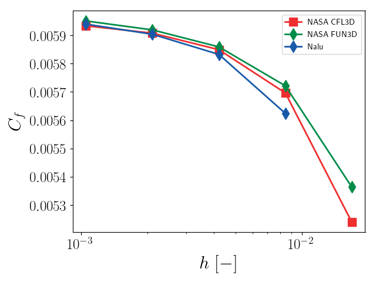
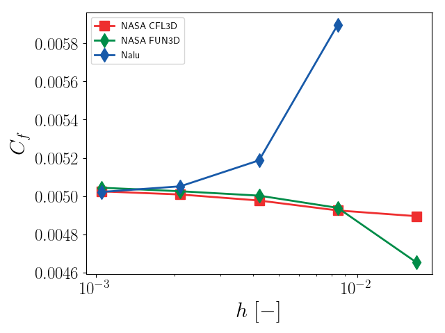
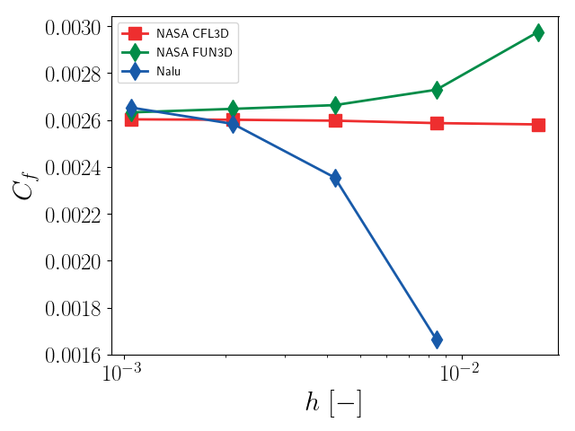
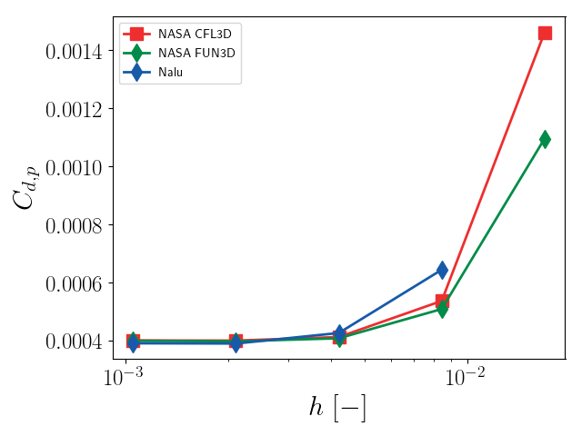

# 2D Bump in channel verification

This presents verification efforts for the SST implementation
in [Nalu](https://github.com/NaluCFD/Nalu) using
NASA's
[2D Bump in Channel](https://turbmodels.larc.nasa.gov/bump.html). The
setup, grids, and NASA code results are all taken from that website.

The initial conditions are chosen to ensure the same flow
conditions. The Mach number and Reynolds number (based on a reference
length scale of 1m) are 0.2 and 3 million. The body reference length
is 1.5m. The density of air is 1.177 kg/m^3 and the viscosity is
1.846e-5 kg/ms. The inflow velocity is therefore 47.0518 m/s. No
pressure gradient is imposed between the inlet and outlet (though the
NASA setup does indicate a small pressure drop across the domain). To
ensure as close a setup as the NASA test cases, no wall function is
used to model the SST wall boundary conditions and the BC for the SST
model are set according to
the
[NASA specifications](https://turbmodels.larc.nasa.gov/flatplate_sst.html).

## Using this repository
A.  Generating the meshes

1. Get CGNS mesh from [the NASA website](https://turbmodels.larc.nasa.gov/bump_grids.html)
2. Use Pointwise to label the surfaces and set the BC

B. Running

```
mpiexec -np 1 ./naluX -i bumpChannel.yaml
```

C. Post-processing
```
./pp.py # reads Nalu data, generates tables of quantities of interest
./plot_verification.py
```

## RANS SST 

### Verification

There is good agreement between Nalu's SST implementation
and
[NASA's SST implementation](https://turbmodels.larc.nasa.gov/flatplate_sst.html).

#### Convergence of skin friction coefficient at x = 0.75


#### Convergence of skin friction coefficient at x = 0.6321075


#### Convergence of skin friction coefficient at x = 0.8678025


#### Convergence of drag coefficient


#### Convergence of pressure drag coefficient


#### Convergence of velocity drag coefficient


#### Convergence of lift coefficient


#### Skin friction coefficient along the bump at t = 0.5 (1409x641 mesh)


#### Pressure coefficient along the bump at t = 0.5 (1409x641 mesh)


#### Nondimensional eddy viscosity profile at x = 0.75 (1409x641 mesh)


#### Nondimensional turbulent kinetic energy profile at x = 0.75 (1409x641 mesh)


#### Nondimensional specific dissipation rate profile at x = 0.75 (1409x641 mesh)


## Thanks
Thanks to Shreyas Ananthan, Ganesh Vijayakumar, and Matt Barone for
their helpful insight and input.
